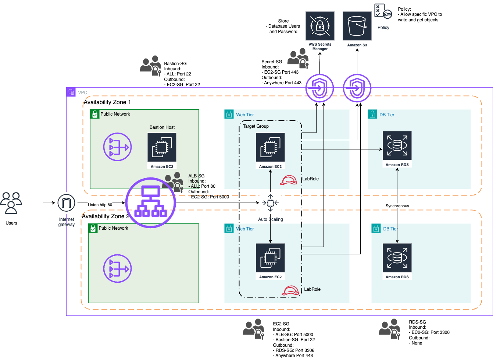
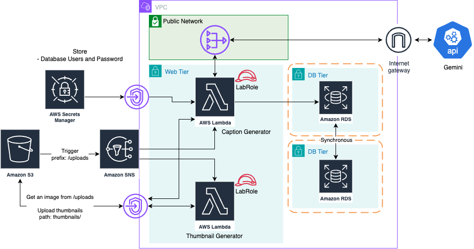

# Introduction

The project demonstrates how to deploy a web application on AWS by utilising cloud services, involving VPC, EC2, RDS, S3, and Lambda. These services have to provide high availability and reliability by well designing cloud architecture; ALB and auto scaling are introduced, spanning services to multiple availability zones. To ensure security of the system, we isolated services to different subnets which have security groups to allow authorized access. Users cannot directly access the web application and database, they need to access through a load balancer

# Architecture Diagrams

If a user uploads an image via the web application, the web application stores an image to the s3 in the “uploads/” folder. In the meantime, Amazon SNS is listening to an event when an image is uploaded to the folder and triggers to both AWS Lambda functions. One is for thumbnail generation, and the other one is image captioning.

Both of them are placed in a web-tier subnet, which has a route to access to secret manager, amazon S3, and database. For the image captioning, it has to be able to access the internet, calling Gemini api. This can be done by a NAT router that is placed in a public network, allowing the lambda function to access outside. 
